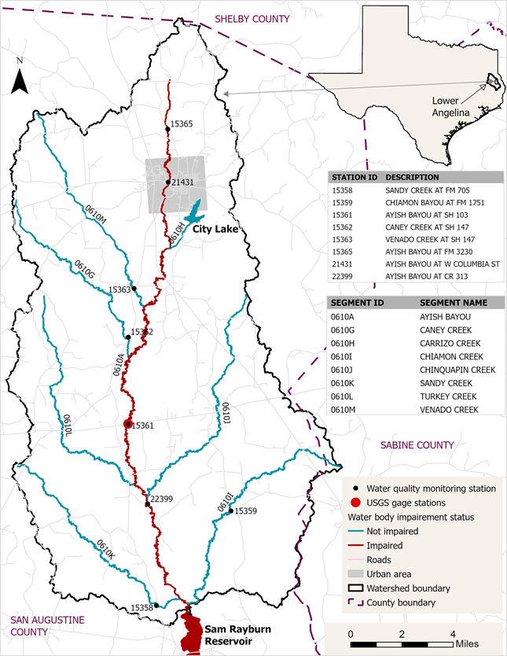

```{r setup, include=FALSE}
## load libraries
library(officer)
library(officedown)
library(flextable)
library(ragg)

## this sets our default code chunk options
knitr::opts_chunk$set(dev = "ragg_png",
                      echo = FALSE,
                      ## figure chunk options
                      fig.cap = TRUE,
                      fig.width = 6)

## flextable defaults

flextable::set_flextable_defaults(digits = 2)


library(readxl)
library(dplyr)
library(tidyr)
library(janitor)
library(ggplot2)
library(patchwork)


df <- read_excel("../data/data.xlsx", col_types = c("text",
    "text", "text", "text", "date", "text",
    "text", "text", "text", "text", "text",
    "text", "text", "text", "text", "text",
    "text", "text", "text", "text", "text",
    "text", "text", "text", "text", "text",
    "text", "text", "text"))

df <- df |> 
  #filter(tag != "K004989") |> 
  pivot_longer(cols = "TEMPERATURE, WATER (DEGREES CENTIGRADE)":"SULFATE (MG/L AS SO4)") |> 
  mutate(censor = case_when(
    stringr::str_starts(value, "<") ~ "<",
    stringr::str_starts(value, ">") ~ ">",
    .default = NA
  )) |> 
  mutate(value = stringr::str_remove(value, "<")) |> 
  mutate(value = stringr::str_remove(value, ">")) |> 
  mutate(value = as.numeric(value))

```


Texas Water Resources Institute`r run_linebreak()`
Texas A&M AgriLife`r run_linebreak()`
College Station, TX


Report developed for and funded by the Texas Commission on Environmental Quality.


```{r}
## leave in, starts new word document section
## after table of abbreviations
block_section(prop_section(type = "nextPage"))
```

::: {custom-style="Unnumbered Heading 1"}

Table of Contents

:::

<!---BLOCK_TOC--->

::: {custom-style="Unnumbered Heading 1"}

Table of Figures

:::

<!---BLOCK_TOC{seq_id: 'fig'}--->

::: {custom-style="Unnumbered Heading 1"}

Table of Tables

:::

<!---BLOCK_TOC{seq_id: 'tab'}--->


```{r}
## leave in, ends word document section
block_section(
  prop_section(type = "nextPage", 
               footer_default = block_list(
                 fpar(run_word_field(field = "PAGE \\* roman"),
                      fp_p = fp_par(text.align = "center"))
                 )
               )
  )
```


# Introduction

Work under this data collection project included water quality data collection 
in Ayish Bayou and its tributaries for future watershed planning efforts.
Water quality data on the Ayish Bayou and its tributaries was collected to 
provide improved temporal and spatial data resolution for future watershed 
planning and assessment purposes. 
Water quality monitoring was conducted monthly at monitoring stations 15361, 
15365, 21431, 22399 on TCEQ Segment 0610A (Ayish Bayou), 15358 on 0610K 
(Sandy Creek), 15359 on 0610I (Chiamon Creek), 15362 on 0610G (Caney Creek), 
and 15363 on 0610M (Venado Creek; Figure \@ref(fig:map)). The *2022 Texas Integrated Report of
Surface Water Quality* provides the following segment descriptions [@tceq2022TexasIntegrated2022]:

- **0610A Ayish Bayou**: Perennial stream from the headwaters of Sam Rayburn 
Reservoir to the dam impounding Bland Lake approximately 0.1km upstream of FM 
1279 near the City of San Augustine.

- **0610K Sandy Creek in San Augustine County**: From the confluence with Ayish 
Bayou (0610A) upstream to headwaters in San Augustine County.

- **0610I Chiamon Creek**: From the confluence with Ayish Bayou (0610A) in San 
Augustine County upstream to headwaters in Sabine County.

- **0610G Caney Creek in San Augustine County**: From the confluence with Ayish 
Bayou (0610A) in San Augustine County upstream to headwaters.

- **0610M Venado Creek**: From the confluence with Ayish Bayou (0610A) upstream 
to headwaters in San Augustine County.

These water bodies are considered perennial with a "high" Aquatic Life Use designation.
Ayish Bayou (0610A) was identified as impaired in the *2022 Texas 
Integrated Report of Surface Water Quality* for exceeding the primary 
recreation use I criterion due to elevated *Escherichia coli* (*E. coli*) 
and was first listed impaired in 2000 [@tceq2022TexasIntegrated2022].
Focus of the monitoring project was for bacterial impairments, but other
water quality parameters were collected to provide further information for 
planning efforts.
Sites were selected to characterize potential upstream to downstream
spatial variability and based on safe publicly accessible sampling locations.
Under this project sampling included collection of basic field parameters,
conventional, and bacteriological parameters. Sampling occurred monthly at all 
sites; however, sites 15361 and 21431 on Ayish Bayou were sampled quarterly under
the previously planned quarterly Clean Rivers Program monitoring efforts.
Quarterly samples are not included in this report.
All work was conducted under an approved Quality Assurance Project Plan.


<!-- Insert map of sample sites -->
```{r map, fig.width=645/96*0.95, fig.height=834/96*0.95, dpi=96, fig.cap="Map of Ayish Bayou watershed, segments, and monitoring stations."}

```

<!-- Generate Summary of trips and dates -->

# Data Summary

Table \@ref(tab:summary) provides a  summary of the number of
samples (n), minimum, maximum, standard deviation, and measure of central tendency
for conventional, bacteria, and certain field parameters by site. 
Geometric means are reported for *E. coli* and means are reported for all 
other parameters. 
Full data records for field, conventional, and bacteriological from 
all sites are listed by segment in Appendix A (Tables \@ref(tab:ayishfield)-\@ref(tab:venado)).

```{r}
## leave in, ends word document section
block_section(
  prop_section(type = "nextPage", 
               footer_default = block_list(
                 fpar(run_word_field(field = "PAGE \\* ARABIC"),
                      fp_p = fp_par(text.align = "center"))
                 )
               )
  )
```


```{r message=FALSE, warning=FALSE, tab.cap='Summary of conventional, bacteria, and field samples collected during the project.', tab.id='summary'}

params <- df |> 
  distinct(name) |> 
  filter(name != "E_COLI, COLILERT, IDEXX, HOLDING TIME") |>
  filter(name != "DEPTH OF BOTTOM OF WATER BODY AT SAMPLE SITE MET") |> 
  pull(name)
## can we highlight cells that exceed critria?
df |> 
  filter(name %in% params) |> 
  group_by(`Station Id`, `Station_Desc`, name) |> 
  summarise(n = n(),
            min = min(value),
            max = max(value),
            "Standard deviation" = round(sd(value),2),
            mean = round(mean(value),2),
            geomean = round(EnvStats::geoMean(value), 2)) |> 
  mutate(center = case_when(
    name == "E_ COLI, COLILERT, IDEXX METHOD, MPN/100ML" ~ geomean,
    .default = mean)) |> 
  ungroup() |> 
  mutate("SWQM Site" = paste0(`Station Id`, " ", Station_Desc)) |> 
  select(-c("mean", "geomean", "Station Id", "Station_Desc")) |> 
  mutate(name = case_when(
    name == "E_ COLI, COLILERT, IDEXX METHOD, MPN/100ML" ~ "E. COLI, COLILERT, IDEXX METHOD (MPN/100ML)",
    name == "SPECIFIC CONDUCTANCE,FIELD (UMHOS/CM @ 25C)" ~ "SPECIFIC CONDUCTANCE, FIELD (UMHOS/CM @ 25C)",
    .default = name
  )) |> 
  group_by(`SWQM Site`) |> 
  flextable::as_grouped_data(groups = c("SWQM Site")) |> 
  flextable::as_flextable() |> 
  bold(j = 1, i = ~ !is.na(`SWQM Site`), bold = TRUE, part = "body") |> 
  flextable::autofit() |>
  style(j = 1, i = ~ !is.na(`SWQM Site`),
        pr_p = fp_par(padding.right = 1.5)
        ) |> 
  flextable::fontsize(size = 9, part = "all") |> 
  flextable::bold(part = "header") |> 
  ## this is a decimal tab
  #tab_settings(j = 1, i = ~ !is.na(name), value = fp_tabs(fp_tab(pos = 0.5, style = "decimal")), part = "body") |> 
  flextable::colformat_num(drop0trailing = TRUE) |> 
  flextable::set_header_labels(name = "Parameter",
                               min = "Minimum",
                               max = "Maximum",
                               center = "Center") |> 
  flextable::padding(padding = 1, part = "all") |> 
  footnote(i = 1, j = 6,
           value = as_paragraph(as_chunk("Center refers to the geometric mean for ", props = fp_text_default(font.size = 9)), 
                                as_chunk("E. coli" , props = fp_text_default(italic = TRUE, font.size = 9)),
                                as_chunk(" and the mean for all other parameters.", props = fp_text_default(font.size = 9))),
           ref_symbols = "a", part = "header")
```

```{r}
block_section(
  prop_section(
    page_size = page_size(orient = "landscape"),
    type = "nextPage",
    footer_default = block_list(
                 fpar(run_word_field(field = "PAGE \\* ARABIC"),
                      fp_p = fp_par(text.align = "center"))
                 )
  )
)
```

<!-- Water quality monitoring was conducted monthly at monitoring stations 15361,  -->
<!-- 15365, 21431, 22399 on TCEQ Segment 0610A (Ayish Bayou), 15358 on 0610K  -->
<!-- (Sandy Creek), 15359 on 0610I (Chiamon Creek), 15362 on 0610G (Caney Creek),  -->
<!-- and 15363 on 0610M (Venado Creek). -->


The distribution of and time series of dissolved oxygen, *E. coli*, nitrate,
nitrite, ammonia, Kjeldahl nitrogen, and total phosphorus concentrations are shown 
in Figures \@ref(fig:do) - \@ref(fig:tp).
The majority of dissolved oxygen concentrations were above the minimum and grab 
screening level standards (Figure \@ref(fig:do)). However, stations 15359 (Chiamon Creek) and 15362 
(Caney Creek) had high proportions of measurements below either the grab 
screening level (5 mg/L) or minimum dissolved oxygen criteria (3 mg/L) for 
high aquatic life use. All stations had *E. coli* average geometric mean 
concentrations above the primary recreation I criteria of 126 MPN/100 mL 
(Figure \@ref(fig:ecoli)). Nitrate nitrogen and total phosphorus were well below 
the screening level across all stations (Figures \@ref(fig:nitrate); \@ref(fig:tp)).
Nearly all of the nitrite-nitrogen and ammonia samples were below laboratory
limits of quantification (Figures \@ref(fig:nitrite); \@ref(fig:ammonia)).
Across all sites, streamflow variability ranged from zero flow to 720 cubic 
feet per second (Figures \@ref(fig:flow)). The largest instantaneous flow values 
were measured along the mainstem of Ayish Bayou and appears to have sustained
flows through the year. Chiamon Creek, Caney Creek, and Sandy Creek all had 
periods of zero-streamflow.


```{r do, fig.cap="Grab dissolved oxygen samples by (A) station and by (B) date. Dissolved oxygen grab minimum and screening level criterion are indicated by the solid and dashed lines.", fig.alt="Alternative text for screen readers", fig.width=6, fig.height=8, fig.dpi=200}
p1 <- df |> 
  filter(name %in% params[[3]]) |> 
  ggplot() +
  geom_boxplot(aes(x = `Station Id`, y = value), outliers = FALSE) +
  geom_jitter(aes(x = `Station Id`, y = value), width = 0.1, height = 0, alpha = 0.5, color = "dodgerblue") +
  geom_hline(aes(yintercept = 5, linetype = "Dissolved Oxygen Grab Screening Level")) +
  geom_hline(aes(yintercept = 3, linetype = "Dissolved Oxygen Grab Minimum")) +
  scale_linetype_manual("", values= c(1,2)) +
  labs(y = params[[3]], x = "SWQM Station ID") +
  theme_bw()
  

p2 <- df |> 
  filter(name %in% params[[3]]) |> 
  ggplot() +
  geom_point(aes(x = Date, y = value, group = `Station Id`), alpha = 0.5, color = "dodgerblue") +
  #geom_line(aes(x = Date, y = value, group = `Station Id`), alpha = 0.5) +
  geom_hline(aes(yintercept = 5, linetype = "Dissolved Oxygen Grab Screening Level")) +
  geom_hline(aes(yintercept = 3, linetype = "Dissolved Oxygen Grab Minimum")) +
  facet_wrap(vars(`Station Id`)) +
  scale_linetype_manual("", values= c(1,2)) +
  labs(y = params[[3]], x = "Date") +
  theme_bw()

p1 / p2 + plot_annotation(tag_levels = "A") + 
  plot_layout(axis_titles = "collect_y", guides = "collect") &
  theme(legend.position = "bottom")
  
```


```{r fig.alt="Alternative text for screen readers", fig.width=6, fig.height=8.25, fig.dpi=200}
p1 <- df |> 
  filter(name %in% params[[6]]) |> 
  mutate(name = case_when(
    name == "E_ COLI, COLILERT, IDEXX METHOD, MPN/100ML" ~ "E. COLI, COLILERT, IDEXX METHOD (MPN/100ML)",
    .default = name
  )) |> 
  ggplot() +
  geom_boxplot(aes(x = `Station Id`, y = value), outliers = FALSE) +
  geom_jitter(aes(x = `Station Id`, y = value, color = censor), width = 0.1, height = 0, alpha = 0.5) +
  geom_hline(aes(yintercept = 126, linetype = "Geometric Mean Criterion")) +
  geom_hline(aes(yintercept = 399, linetype = "Single Sample Criterion")) +
  scale_y_log10() +
  scale_color_grey("", labels = c("Right-censored (>)", "Lab-reported value"), na.value = "dodgerblue") +
  scale_linetype_manual("", values= c(1,2)) +
  labs(y = "E. COLI, COLILERT, IDEXX METHOD (MPN/100ML)", x = "SWQM Station ID") +
  theme_bw()
  

p2 <- df |> 
  filter(name %in% params[[6]]) |> 
  ggplot() +
  geom_point(aes(x = Date, y = value, group = `Station Id`, color = censor), alpha = 0.5) +
  geom_hline(aes(yintercept = 126, linetype = "Geometric Mean Criterion")) +
  geom_hline(aes(yintercept = 399, linetype = "Single Sample Criterion")) +
  facet_wrap(vars(`Station Id`)) +
  scale_y_log10() +
  scale_color_grey("", labels = c("Right-censored (>)", "Lab-reported value"), na.value = "dodgerblue") +
  scale_linetype_manual("", values= c(1,2)) +
  labs(y = "E. COLI, COLILERT, IDEXX METHOD (MPN/100ML)", x = "Date") +
  theme_bw()

p1 / p2 + 
  plot_annotation(tag_levels = "A") + 
  plot_layout(axis_titles = "collect_y", guides = "collect") &
  theme(legend.position = "bottom",
        legend.direction = "vertical")
  
```

<caption>
`r fpar(run_autonum(seq_id = 'fig', bkm = 'ecoli', pre_label = "Figure "), ftext("Grab "), ftext("E. coli", prop = fp_text_lite(italic = TRUE)), ftext(" samples by (A) station and by (B) date. Seven-year geometric mean and single sample criterion are indicated by the solid and dashed lines. Censored values are greater than the laboratory reported level of quantification."), fp_p = fp_par_lite(word_style = "Image Caption"))`
</caption>


```{r nitrate, fig.cap="Grab nitrate-nitrogen samples by (A) station and by (B) date. The 1.95 mg/L screening level is indicated by the dashed line. Censored values are less than the laboratory level of quantification.", fig.alt="Alternative text for screen readers", fig.width=6, fig.height=8, fig.dpi=200}
p1 <- df |> 
  filter(name %in% params[[8]]) |> 
  ggplot() +
  geom_boxplot(aes(x = `Station Id`, y = value), outliers = FALSE) +
  geom_jitter(aes(x = `Station Id`, y = value, color = censor), width = 0.1, height = 0, alpha = 0.5) +
  geom_hline(aes(yintercept = 1.95, linetype = "Screening level (1.95 mg/L)")) +
  #scale_y_log10() +
  scale_linetype_manual("", values= c(2)) +
  scale_color_grey("", labels = c("Left-censored (<)", "Lab-reported value"), na.value = "dodgerblue") +
  labs(y = params[[8]], x = "SWQM Station ID") +
  theme_bw()
  

p2 <- df |> 
  filter(name %in% params[[8]]) |> 
  ggplot() +
  geom_point(aes(x = Date, y = value, group = `Station Id`, color = censor), alpha = 0.5) +
  geom_hline(aes(yintercept = 1.95, linetype = "Screening level (1.95 mg/L)")) +
  #geom_hline(aes(yintercept = 399, linetype = "Single Sample Criterion")) +
  facet_wrap(vars(`Station Id`)) +
  scale_linetype_manual("", values= c(2)) +
  scale_color_grey("", labels = c("Left-censored (<)", "Lab-reported value"), na.value = "dodgerblue") +
  labs(y = params[[8]], x = "Date") +
  theme_bw()

p1 / p2 + 
  plot_annotation(tag_levels = "A") + 
  plot_layout(axis_titles = "collect_y", guides = "collect") &
  theme(legend.position = "bottom")
  
```

```{r nitrite, fig.cap="Grab nitrite-nitrogen samples by (A) station and by (B) date. Censored values are less than the laboratory level of quantification.", fig.alt="Alternative text for screen readers", fig.width=6, fig.height=8, fig.dpi=200}
p1 <- df |> 
  filter(name %in% params[[9]]) |> 
  ggplot() +
  geom_boxplot(aes(x = `Station Id`, y = value), outliers = FALSE) +
  geom_jitter(aes(x = `Station Id`, y = value, color = censor), width = 0.1, height = 0, alpha = 0.5) +
  #geom_hline(aes(yintercept = 1.95, linetype = "Screening level (1.95 mg/L)")) +
  #scale_y_log10() +
  #scale_linetype_manual("", values= c(2)) +
  scale_color_grey("", labels = c("Left-censored (<)", "Lab-reported value"), na.value = "dodgerblue") +
  labs(y = params[[9]], x = "SWQM Station ID") +
  coord_cartesian(ylim = c(0,0.1)) +
  theme_bw()
  

p2 <- df |> 
  filter(name %in% params[[9]]) |> 
  ggplot() +
  geom_point(aes(x = Date, y = value, group = `Station Id`, color = censor), alpha = 0.5) +
  #geom_hline(aes(yintercept = 1.95, linetype = "Screening level (1.95 mg/L)")) +
  #geom_hline(aes(yintercept = 399, linetype = "Single Sample Criterion")) +
  facet_wrap(vars(`Station Id`)) +
  #scale_linetype_manual("", values= c(2)) +
  scale_color_grey("", labels = c("Left-censored (<)", "Lab-reported value"), na.value = "dodgerblue") +
  labs(y = params[[9]], x = "Date") +
  coord_cartesian(ylim = c(0,0.1)) +
  theme_bw()

p1 / p2 + 
  plot_annotation(tag_levels = "A") + 
  plot_layout(axis_titles = "collect_y", guides = "collect") &
  theme(legend.position = "bottom")
  
```


```{r ammonia, fig.cap="Grab nitrogen-ammonia samples by (A) station and by (B) date. Censored values are less than the laboratory level of quantification.", fig.alt="Alternative text for screen readers", fig.width=6, fig.height=8, fig.dpi=200}
p1 <- df |> 
  filter(name %in% params[[10]]) |> 
  ggplot() +
  geom_boxplot(aes(x = `Station Id`, y = value), outliers = FALSE) +
  geom_jitter(aes(x = `Station Id`, y = value, color = censor), width = 0.1, height = 0, alpha = 0.5) +
  geom_hline(aes(yintercept = 0.35, linetype = "Screening level (0.33 mg/L)")) +
  #scale_y_log10() +
  scale_linetype_manual("", values= c(2)) +
  scale_color_grey("", labels = c("Left-censored (<)", "Lab-reported value"), na.value = "dodgerblue") +
  labs(y = params[[10]], x = "SWQM Station ID") +
  coord_cartesian(ylim = c(0,0.35)) +
  theme_bw()
  

p2 <- df |> 
  filter(name %in% params[[10]]) |> 
  ggplot() +
  geom_point(aes(x = Date, y = value, group = `Station Id`, color = censor), alpha = 0.5) +
  geom_hline(aes(yintercept = 0.33, linetype = "Screening level (0.33 mg/L)")) +
  #geom_hline(aes(yintercept = 399, linetype = "Single Sample Criterion")) +
  facet_wrap(vars(`Station Id`)) +
  scale_linetype_manual("", values= c(2)) +
  scale_color_grey("", labels = c("Left-censored (<)", "Lab-reported value"), na.value = "dodgerblue") +
  labs(y = params[[10]], x = "Date") +
  coord_cartesian(ylim = c(0,0.35)) +
  theme_bw()

p1 / p2 + 
  plot_annotation(tag_levels = "A") + 
  plot_layout(axis_titles = "collect_y", guides = "collect") &
  theme(legend.position = "bottom")
  
```


```{r kjeldahl, fig.cap="Grab nitrogen-Kjeldahl samples by (A) station and by (B) date. Censored values are less than the laboratory level of quantification.", fig.alt="Alternative text for screen readers", fig.width=6, fig.height=8, fig.dpi=200}
p1 <- df |> 
  filter(name %in% params[[11]]) |> 
  ggplot() +
  geom_boxplot(aes(x = `Station Id`, y = value), outliers = FALSE) +
  geom_jitter(aes(x = `Station Id`, y = value, color = censor), width = 0.1, height = 0, alpha = 0.5) +
  #geom_hline(aes(yintercept = 1.95, linetype = "Screening level (1.95 mg/L)")) +
  #scale_y_log10() +
  #scale_linetype_manual("", values= c(2)) +
  scale_color_grey("", labels = c("Left-censored (<)", "Lab-reported value"), na.value = "dodgerblue") +
  labs(y = params[[11]], x = "SWQM Station ID") +
  coord_cartesian(ylim = c(0,1.5)) +
  theme_bw()
  

p2 <- df |> 
  filter(name %in% params[[11]]) |> 
  ggplot() +
  geom_point(aes(x = Date, y = value, group = `Station Id`, color = censor), alpha = 0.5) +
  #geom_hline(aes(yintercept = 1.95, linetype = "Screening level (1.95 mg/L)")) +
  #geom_hline(aes(yintercept = 399, linetype = "Single Sample Criterion")) +
  facet_wrap(vars(`Station Id`)) +
  #scale_linetype_manual("", values= c(2)) +
  scale_color_grey("", labels = c("Left-censored (<)", "Lab-reported value"), na.value = "dodgerblue") +
  labs(y = params[[11]], x = "Date") +
  coord_cartesian(ylim = c(0,1.5)) +
  theme_bw()

p1 / p2 + 
  plot_annotation(tag_levels = "A") + 
  plot_layout(axis_titles = "collect_y", guides = "collect") &
  theme(legend.position = "bottom")
  
```


```{r tp, fig.cap="Grab total phosphorus samples by (A) station and by (B) date. The dotted line indicates the 0.69 mg/L screening level. Censored values are less than the laboratory level of quantification.", fig.alt="Alternative text for screen readers", fig.width=6, fig.height=8, fig.dpi=200}
p1 <- df |> 
  filter(name %in% params[[12]]) |> 
  ggplot() +
  geom_boxplot(aes(x = `Station Id`, y = value), outliers = FALSE) +
  geom_jitter(aes(x = `Station Id`, y = value, color = censor), width = 0.1, height = 0, alpha = 0.5) +
  geom_hline(aes(yintercept = 1.95, linetype = "Screening level (0.69 mg/L)")) +
  #scale_y_log10() +
  scale_linetype_manual("", values= c(2)) +
  scale_color_grey("", labels = c("Left-censored (<)", "Lab-reported value"), na.value = "dodgerblue") +
  labs(y = params[[12]], x = "SWQM Station ID") +
  #coord_cartesian(ylim = c(0,1.5)) +
  theme_bw()
  

p2 <- df |> 
  filter(name %in% params[[12]]) |> 
  ggplot() +
  geom_point(aes(x = Date, y = value, group = `Station Id`, color = censor), alpha = 0.5) +
  geom_hline(aes(yintercept = 1.95, linetype = "Screening level (0.69 mg/L)")) +
  #geom_hline(aes(yintercept = 399, linetype = "Single Sample Criterion")) +
  facet_wrap(vars(`Station Id`)) +
  scale_linetype_manual("", values= c(2)) +
  scale_color_grey("", labels = c("Left-censored (<)", "Lab-reported value"), na.value = "dodgerblue") +
  labs(y = params[[12]], x = "Date") +
  #coord_cartesian(ylim = c(0,1.5)) +
  theme_bw()

p1 / p2 + 
  plot_annotation(tag_levels = "A") + 
  plot_layout(axis_titles = "collect_y", guides = "collect") &
  theme(legend.position = "bottom")
  
```


```{r flow, fig.cap=" (A) Histogram of total distribution of all instantaneous streamflow measurements and (B) instantaneous streamflow measurements by date and station.", fig.alt="Alternative text for screen readers", fig.width=6, fig.height=8, fig.dpi=200}


p1 <- df |> 
  select(tag, `Station Id`, `FLOW MTH 1=GAGE 2=ELEC 3=MECH 4=WEIR/FLU 5=DOPPL`, `FLOW  STREAM, INSTANTANEOUS (CUBIC FEET PER SEC)`, `STREAM FLOW ESTIMATE (CFS)`, Date) |> 
  mutate(Flow = case_when(
    is.na(`FLOW  STREAM, INSTANTANEOUS (CUBIC FEET PER SEC)`) ~ `STREAM FLOW ESTIMATE (CFS)`,
    !is.na(`FLOW  STREAM, INSTANTANEOUS (CUBIC FEET PER SEC)`) ~ stringr::str_remove(`FLOW  STREAM, INSTANTANEOUS (CUBIC FEET PER SEC)`, "<"),
    .default = `FLOW  STREAM, INSTANTANEOUS (CUBIC FEET PER SEC)`
  )) |> 
  mutate(Flow = as.numeric(Flow)) |> 
  distinct(tag, `Station Id`, Date, Flow) |> 
  ggplot() + 
  geom_histogram(aes(Flow), bins = 50) +
  scale_x_continuous("Instantaneous Streamflow (cfs)",
                     labels = scales::label_comma(),
                     transform = "pseudo_log",
                     breaks = c(0,1,5,10,50,100,500,1000),
                     minor_breaks = c(2,3,4,6,7,8,9,20,30,40,60,70,80,90,200,300,400,600,700,800,900)) +
  theme_bw()


p2 <- df |> 
  select(tag, `Station Id`, `FLOW MTH 1=GAGE 2=ELEC 3=MECH 4=WEIR/FLU 5=DOPPL`, `FLOW  STREAM, INSTANTANEOUS (CUBIC FEET PER SEC)`, `STREAM FLOW ESTIMATE (CFS)`, Date) |> 
  mutate(Flow = case_when(
    is.na(`FLOW  STREAM, INSTANTANEOUS (CUBIC FEET PER SEC)`) ~ `STREAM FLOW ESTIMATE (CFS)`,
    !is.na(`FLOW  STREAM, INSTANTANEOUS (CUBIC FEET PER SEC)`) ~ stringr::str_remove(`FLOW  STREAM, INSTANTANEOUS (CUBIC FEET PER SEC)`, "<"),
    .default = `FLOW  STREAM, INSTANTANEOUS (CUBIC FEET PER SEC)`
  )) |> 
  mutate(Flow = as.numeric(Flow)) |> 
  distinct(tag, `Station Id`, Date, Flow) |> 
  ggplot() +
  geom_point(aes(Date, Flow)) +
  facet_wrap(vars(`Station Id`)) +
  scale_y_continuous("Instantaneous Streamflow (cfs)",
                     labels = scales::label_comma(),
                     transform = "pseudo_log",
                     breaks = c(0,1,10,100,1000),
                     minor_breaks = c(2,3,4,5,6,7,8,9,20,30,40,50,60,70,80,90,200,300,400,500,600,700,800,900)) +
  theme_bw()

p1 / p2 +
  plot_annotation(tag_levels = "A") + 
  plot_layout(axis_titles = "collect_y", guides = "collect") &
  theme(legend.position = "bottom")

```


```{r}
## leave in, ends word document section
block_section(
  prop_section(type = "nextPage", 
               footer_default = block_list(
                 fpar(run_word_field(field = "PAGE \\* ARABIC"),
                      fp_p = fp_par(text.align = "center"))
                 )
               )
  )
```

# Bibliography {-}

<div id="refs"></div>

```{r}
## leave in, ends word document section
block_section(
  prop_section(type = "nextPage", 
               footer_default = block_list(
                 fpar(run_word_field(field = "PAGE \\* ARABIC"),
                      fp_p = fp_par(text.align = "center"))
                 )
               )
  )
```


# Appendix A {-}

```{r}
## leave in, ends word document section
block_section(
  prop_section(type = "nextPage", 
               footer_default = block_list(
                 fpar(run_word_field(field = "PAGE \\* ARABIC"),
                      fp_p = fp_par(text.align = "center"))
                 )
               )
  )
```


## Ayish Bayou 0610A Data

```{r ayishfield, tab.cap="Field parameter data for Ayish Bayou Segment 0610A.", tab.id="ayishfield"}


df_field <- read_excel("../data/data.xlsx", col_types = c("text",
    "text", "text", "text", "date", "text",
    "text", "text", "text", "text", "text",
    "text", "text", "text", "text", "text",
    "text", "text", "text", "text", "text",
    "text", "text", "text", "text", "text",
    "text", "text", "text"))

df_field |> 
  filter(`Station Id` %in% c("22399", "15361", "21431", "15365")) |> 
  mutate(Date = as.Date(Date)) |> 
  select(tag, `Station Id`, Station_Desc, Date, `FLOW MTH 1=GAGE 2=ELEC 3=MECH 4=WEIR/FLU 5=DOPPL`, `FLOW  STREAM, INSTANTANEOUS (CUBIC FEET PER SEC)`, `FLOW:1=No Flow,2=Low,3=Normal,4=Flood,5=High,6=Dry`, `STREAM FLOW ESTIMATE (CFS)`, `DAYS SINCE PRECIPITATION EVENT (DAYS)`, `TEMPERATURE, WATER (DEGREES CENTIGRADE)`, `PH (STANDARD UNITS)`, `SPECIFIC CONDUCTANCE,FIELD (UMHOS/CM @ 25C)`, `TRANSPARENCY, SECCHI DISC (METERS)`) |> 
  flextable::flextable() |> 
  flextable::fontsize(size = 8, part = "all") |> 
  flextable::bold(part = "header") |> 
  flextable::align(j = c(4:13), align = "right", part = "all") |> 
  flextable::set_header_labels(tag = "Tag ID",
                               `Station Id` = "SWQM Station",
                               Station_Desc = "Station Description") |> 
  flextable::padding(padding = 1, part = "all")
```

`r run_pagebreak()`

```{r ayish, tab.cap="Conventional and bacteria data for Ayish Bayou Segment 0610A.", tab.id="ayish"}
df |> 
  filter(`Station Id` %in% c("22399", "15361", "21431", "15365")) |> 
  select(tag, `Station Id`, Station_Desc, Date, name, value, censor) |> 
  mutate(value = case_when(
    !is.na(censor) ~ stringr::str_c(censor, value),
    is.na(censor) ~ paste0(value))
    ) |> 
  select(tag, `Station Id`, Station_Desc, Date, name, value) |> 
  filter(name %in% c("NITRITE NITROGEN, TOTAL (MG/L AS N)",
                     "NITROGEN, AMMONIA, TOTAL (MG/L AS N)",
                     "NITROGEN, KJELDAHL, TOTAL (MG/L AS N)",
                     "RESIDUE, TOTAL NONFILTRABLE (MG/L)",
                     "SULFATE (MG/L AS SO4)",
                     "OXYGEN, DISSOLVED (MG/L)",
                     "E_ COLI, COLILERT, IDEXX METHOD, MPN/100ML",
                     "CHLORIDE (MG/L AS CL)",
                     "NITRATE NITROGEN, TOTAL (MG/L AS N)",
                     "PHOSPHORUS, TOTAL, WET METHOD (MG/L AS P)")) |> 
  pivot_wider(names_from = name,
              values_from = value) |> 
  mutate(Date = as.Date(Date)) |> 
  flextable::flextable() |> 
  flextable::fontsize(size = 8, part = "all") |> 
  flextable::bold(part = "header") |> 
  flextable::align(j = c(4:14), align = "right", part = "all") |> 
  flextable::set_header_labels(tag = "Tag ID",
                               `Station Id` = "SWQM Station",
                               Station_Desc = "Station Description",
                               `E_ COLI, COLILERT, IDEXX METHOD, MPN/100ML` = "E. COLI, COLILERT, IDEXX METHOD (MPN/100ML)") |> 
  flextable::padding(padding = 1, part = "all")
```

`r run_pagebreak()`

##  Caney Creek 0610G Data

```{r caneyfield, tab.cap="Field parameter data for Caney Creek Segment 0610G.", tab.id="caneyfield"}


df_field |> 
  filter(`Station Id` %in% c("15362")) |> 
  mutate(Date = as.Date(Date)) |> 
  select(tag, `Station Id`, Station_Desc, Date, `FLOW MTH 1=GAGE 2=ELEC 3=MECH 4=WEIR/FLU 5=DOPPL`, `FLOW  STREAM, INSTANTANEOUS (CUBIC FEET PER SEC)`, `FLOW:1=No Flow,2=Low,3=Normal,4=Flood,5=High,6=Dry`, `STREAM FLOW ESTIMATE (CFS)`, `DAYS SINCE PRECIPITATION EVENT (DAYS)`, `TEMPERATURE, WATER (DEGREES CENTIGRADE)`, `PH (STANDARD UNITS)`, `SPECIFIC CONDUCTANCE,FIELD (UMHOS/CM @ 25C)`, `TRANSPARENCY, SECCHI DISC (METERS)`) |> 
  flextable::flextable() |> 
  flextable::fontsize(size = 8, part = "all") |> 
  flextable::bold(part = "header") |> 
  flextable::align(j = c(4:13), align = "right", part = "all") |> 
  flextable::set_header_labels(tag = "Tag ID",
                               `Station Id` = "SWQM Station",
                               Station_Desc = "Station Description") |> 
  flextable::padding(padding = 1, part = "all")
```

`r run_pagebreak()`

```{r caney, tab.cap="Conventional and bacteria data for Caney Creek Segment 0610G.", tab.id="caney"}
df |> 
  filter(`Station Id` %in% c("15362")) |> 
  select(tag, `Station Id`, Station_Desc, Date, name, value, censor) |> 
  mutate(value = case_when(
    !is.na(censor) ~ stringr::str_c(censor, value),
    is.na(censor) ~ paste0(value))
    ) |> 
  select(tag, `Station Id`, Station_Desc, Date, name, value) |> 
  filter(name %in% c("NITRITE NITROGEN, TOTAL (MG/L AS N)",
                     "NITROGEN, AMMONIA, TOTAL (MG/L AS N)",
                     "NITROGEN, KJELDAHL, TOTAL (MG/L AS N)",
                     "RESIDUE, TOTAL NONFILTRABLE (MG/L)",
                     "SULFATE (MG/L AS SO4)",
                     "OXYGEN, DISSOLVED (MG/L)",
                     "E_ COLI, COLILERT, IDEXX METHOD, MPN/100ML",
                     "CHLORIDE (MG/L AS CL)",
                     "NITRATE NITROGEN, TOTAL (MG/L AS N)",
                     "PHOSPHORUS, TOTAL, WET METHOD (MG/L AS P)")) |> 
  pivot_wider(names_from = name,
              values_from = value) |> 
  mutate(Date = as.Date(Date)) |> 
  flextable::flextable() |> 
  flextable::fontsize(size = 8, part = "all") |> 
  flextable::bold(part = "header") |> 
  flextable::align(j = c(4:14), align = "right", part = "all") |> 
  flextable::set_header_labels(tag = "Tag ID",
                               `Station Id` = "SWQM Station",
                               Station_Desc = "Station Description",
                               `E_ COLI, COLILERT, IDEXX METHOD, MPN/100ML` = "E. COLI, COLILERT, IDEXX METHOD (MPN/100ML)") |> 
  flextable::padding(padding = 1, part = "all")
```

`r run_pagebreak()`

## Chiamon Bayou 0610I Data


```{r chiamonfield, tab.cap="Field parameter data for Chiamon Bayou Segment 0610I.", tab.id="chiamonfield"}


df_field |> 
  filter(`Station Id` %in% c("15359")) |> 
  mutate(Date = as.Date(Date)) |> 
  select(tag, `Station Id`, Station_Desc, Date, `FLOW MTH 1=GAGE 2=ELEC 3=MECH 4=WEIR/FLU 5=DOPPL`, `FLOW  STREAM, INSTANTANEOUS (CUBIC FEET PER SEC)`, `FLOW:1=No Flow,2=Low,3=Normal,4=Flood,5=High,6=Dry`, `STREAM FLOW ESTIMATE (CFS)`, `DAYS SINCE PRECIPITATION EVENT (DAYS)`, `TEMPERATURE, WATER (DEGREES CENTIGRADE)`, `PH (STANDARD UNITS)`, `SPECIFIC CONDUCTANCE,FIELD (UMHOS/CM @ 25C)`, `TRANSPARENCY, SECCHI DISC (METERS)`) |> 
  flextable::flextable() |> 
  flextable::fontsize(size = 8, part = "all") |> 
  flextable::bold(part = "header") |> 
  flextable::align(j = c(4:13), align = "right", part = "all") |> 
  flextable::set_header_labels(tag = "Tag ID",
                               `Station Id` = "SWQM Station",
                               Station_Desc = "Station Description") |> 
  flextable::padding(padding = 1, part = "all")
```

`r run_pagebreak()`

```{r chiamon, tab.cap="Conventional and bacteria data for Chiamon Bayou Segment 0610I.", tab.id="chiamon"}
df |> 
  filter(`Station Id` %in% c("15359")) |> 
  select(tag, `Station Id`, Station_Desc, Date, name, value, censor) |> 
  mutate(value = case_when(
    !is.na(censor) ~ stringr::str_c(censor, value),
    is.na(censor) ~ paste0(value))
    ) |> 
  select(tag, `Station Id`, Station_Desc, Date, name, value) |> 
  filter(name %in% c("NITRITE NITROGEN, TOTAL (MG/L AS N)",
                     "NITROGEN, AMMONIA, TOTAL (MG/L AS N)",
                     "NITROGEN, KJELDAHL, TOTAL (MG/L AS N)",
                     "RESIDUE, TOTAL NONFILTRABLE (MG/L)",
                     "SULFATE (MG/L AS SO4)",
                     "OXYGEN, DISSOLVED (MG/L)",
                     "E_ COLI, COLILERT, IDEXX METHOD, MPN/100ML",
                     "CHLORIDE (MG/L AS CL)",
                     "NITRATE NITROGEN, TOTAL (MG/L AS N)",
                     "PHOSPHORUS, TOTAL, WET METHOD (MG/L AS P)")) |> 
  pivot_wider(names_from = name,
              values_from = value) |> 
  mutate(Date = as.Date(Date)) |> 
  flextable::flextable() |> 
  flextable::fontsize(size = 8, part = "all") |> 
  flextable::bold(part = "header") |> 
  flextable::align(j = c(4:14), align = "right", part = "all") |> 
  flextable::set_header_labels(tag = "Tag ID",
                               `Station Id` = "SWQM Station",
                               Station_Desc = "Station Description",
                               `E_ COLI, COLILERT, IDEXX METHOD, MPN/100ML` = "E. COLI, COLILERT, IDEXX METHOD (MPN/100ML)") |> 
  flextable::padding(padding = 1, part = "all")
```


`r run_pagebreak()`

## Sandy Creek 0610K Data


```{r sandyfield, tab.cap="Field parameter data for Sandy Creek Segment 0610K.", tab.id="sandyfield"}


df_field |> 
  filter(`Station Id` %in% c("15358")) |> 
  mutate(Date = as.Date(Date)) |> 
  select(tag, `Station Id`, Station_Desc, Date, `FLOW MTH 1=GAGE 2=ELEC 3=MECH 4=WEIR/FLU 5=DOPPL`, `FLOW  STREAM, INSTANTANEOUS (CUBIC FEET PER SEC)`, `FLOW:1=No Flow,2=Low,3=Normal,4=Flood,5=High,6=Dry`, `STREAM FLOW ESTIMATE (CFS)`, `DAYS SINCE PRECIPITATION EVENT (DAYS)`, `TEMPERATURE, WATER (DEGREES CENTIGRADE)`, `PH (STANDARD UNITS)`, `SPECIFIC CONDUCTANCE,FIELD (UMHOS/CM @ 25C)`, `TRANSPARENCY, SECCHI DISC (METERS)`) |> 
  flextable::flextable() |> 
  flextable::fontsize(size = 8, part = "all") |> 
  flextable::bold(part = "header") |> 
  flextable::align(j = c(4:13), align = "right", part = "all") |> 
  flextable::set_header_labels(tag = "Tag ID",
                               `Station Id` = "SWQM Station",
                               Station_Desc = "Station Description") |> 
  flextable::padding(padding = 1, part = "all")
```

`r run_pagebreak()`

```{r sandy, tab.cap="Conventional and bacteria data for Sandy Creek Segment 0610K.", tab.id="sandy"}
df |> 
  filter(`Station Id` %in% c("15358")) |> 
  select(tag, `Station Id`, Station_Desc, Date, name, value, censor) |> 
  mutate(value = case_when(
    !is.na(censor) ~ stringr::str_c(censor, value),
    is.na(censor) ~ paste0(value))
    ) |> 
  select(tag, `Station Id`, Station_Desc, Date, name, value) |> 
  filter(name %in% c("NITRITE NITROGEN, TOTAL (MG/L AS N)",
                     "NITROGEN, AMMONIA, TOTAL (MG/L AS N)",
                     "NITROGEN, KJELDAHL, TOTAL (MG/L AS N)",
                     "RESIDUE, TOTAL NONFILTRABLE (MG/L)",
                     "SULFATE (MG/L AS SO4)",
                     "OXYGEN, DISSOLVED (MG/L)",
                     "E_ COLI, COLILERT, IDEXX METHOD, MPN/100ML",
                     "CHLORIDE (MG/L AS CL)",
                     "NITRATE NITROGEN, TOTAL (MG/L AS N)",
                     "PHOSPHORUS, TOTAL, WET METHOD (MG/L AS P)")) |> 
  pivot_wider(names_from = name,
              values_from = value) |> 
  mutate(Date = as.Date(Date)) |> 
  flextable::flextable() |> 
  flextable::fontsize(size = 8, part = "all") |> 
  flextable::bold(part = "header") |> 
  flextable::align(j = c(4:14), align = "right", part = "all") |> 
  flextable::set_header_labels(tag = "Tag ID",
                               `Station Id` = "SWQM Station",
                               Station_Desc = "Station Description",
                               `E_ COLI, COLILERT, IDEXX METHOD, MPN/100ML` = "E. COLI, COLILERT, IDEXX METHOD (MPN/100ML)") |> 
  flextable::padding(padding = 1, part = "all")
```

`r run_pagebreak()`

## Venado Creek 0610M Data


```{r venadofield, tab.cap="Field parameter data for Venado Creek Segment 0610M.", tab.id="venadofield"}


df_field |> 
  filter(`Station Id` %in% c("15363")) |> 
  mutate(Date = as.Date(Date)) |> 
  select(tag, `Station Id`, Station_Desc, Date, `FLOW MTH 1=GAGE 2=ELEC 3=MECH 4=WEIR/FLU 5=DOPPL`, `FLOW  STREAM, INSTANTANEOUS (CUBIC FEET PER SEC)`, `FLOW:1=No Flow,2=Low,3=Normal,4=Flood,5=High,6=Dry`, `STREAM FLOW ESTIMATE (CFS)`, `DAYS SINCE PRECIPITATION EVENT (DAYS)`, `TEMPERATURE, WATER (DEGREES CENTIGRADE)`, `PH (STANDARD UNITS)`, `SPECIFIC CONDUCTANCE,FIELD (UMHOS/CM @ 25C)`, `TRANSPARENCY, SECCHI DISC (METERS)`) |> 
  flextable::flextable() |> 
  flextable::fontsize(size = 8, part = "all") |> 
  flextable::bold(part = "header") |> 
  flextable::align(j = c(4:13), align = "right", part = "all") |> 
  flextable::set_header_labels(tag = "Tag ID",
                               `Station Id` = "SWQM Station",
                               Station_Desc = "Station Description") |> 
  flextable::padding(padding = 1, part = "all")
```

`r run_pagebreak()`

```{r venado, tab.cap="Conventional and bacteria data for Venado Creek Segment 0610M.", tab.id="venado"}
df |> 
  filter(`Station Id` %in% c("15363")) |> 
  select(tag, `Station Id`, Station_Desc, Date, name, value, censor) |> 
  mutate(value = case_when(
    !is.na(censor) ~ stringr::str_c(censor, value),
    is.na(censor) ~ paste0(value))
    ) |> 
  select(tag, `Station Id`, Station_Desc, Date, name, value) |> 
  filter(name %in% c("NITRITE NITROGEN, TOTAL (MG/L AS N)",
                     "NITROGEN, AMMONIA, TOTAL (MG/L AS N)",
                     "NITROGEN, KJELDAHL, TOTAL (MG/L AS N)",
                     "RESIDUE, TOTAL NONFILTRABLE (MG/L)",
                     "SULFATE (MG/L AS SO4)",
                     "OXYGEN, DISSOLVED (MG/L)",
                     "E_ COLI, COLILERT, IDEXX METHOD, MPN/100ML",
                     "CHLORIDE (MG/L AS CL)",
                     "NITRATE NITROGEN, TOTAL (MG/L AS N)",
                     "PHOSPHORUS, TOTAL, WET METHOD (MG/L AS P)")) |> 
  pivot_wider(names_from = name,
              values_from = value) |> 
  mutate(Date = as.Date(Date)) |> 
  flextable::flextable() |> 
  flextable::fontsize(size = 8, part = "all") |> 
  flextable::bold(part = "header") |> 
  flextable::align(j = c(4:14), align = "right", part = "all") |> 
  flextable::set_header_labels(tag = "Tag ID",
                               `Station Id` = "SWQM Station",
                               Station_Desc = "Station Description",
                               `E_ COLI, COLILERT, IDEXX METHOD, MPN/100ML` = "E. COLI, COLILERT, IDEXX METHOD (MPN/100ML)") |> 
  flextable::padding(padding = 1, part = "all")
```

```{r}
block_section(
  prop_section(
    page_size = page_size(orient = "landscape"),
    type = "nextPage",
    footer_default = block_list(
                 fpar(run_word_field(field = "PAGE \\* ARABIC"),
                      fp_p = fp_par(text.align = "center"))
                 )
  )
)
```


```{r}
## leave in, ends word document section
block_section(
  prop_section(type = "continuous", 
               footer_default = block_list(
                 fpar(run_word_field(field = "PAGE \\* ARABIC"),
                      fp_p = fp_par(text.align = "center"))
                 )
               )
  )
```
